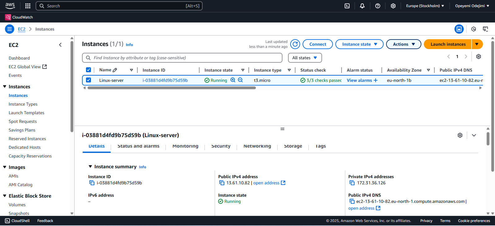
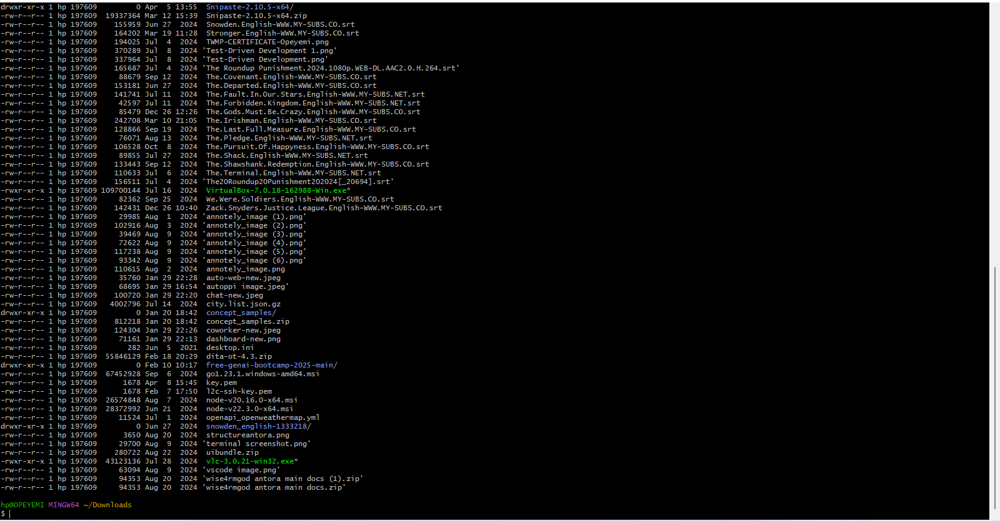
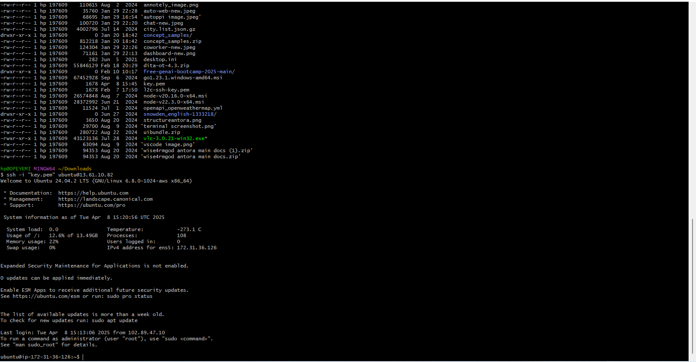
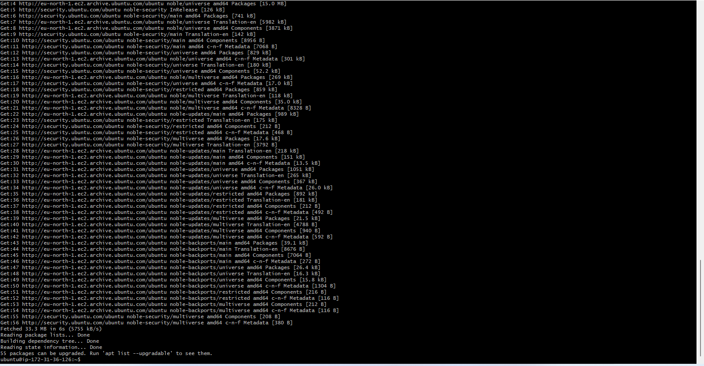
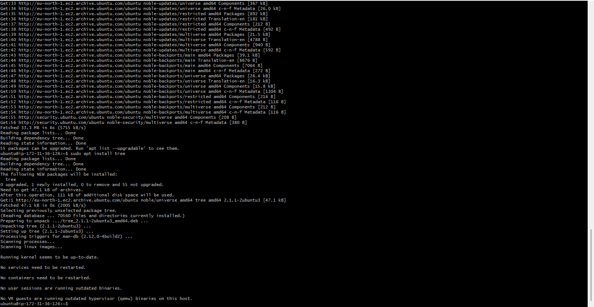
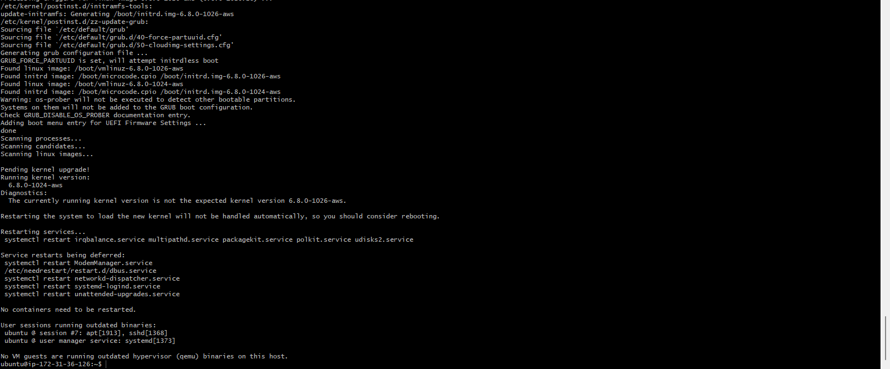
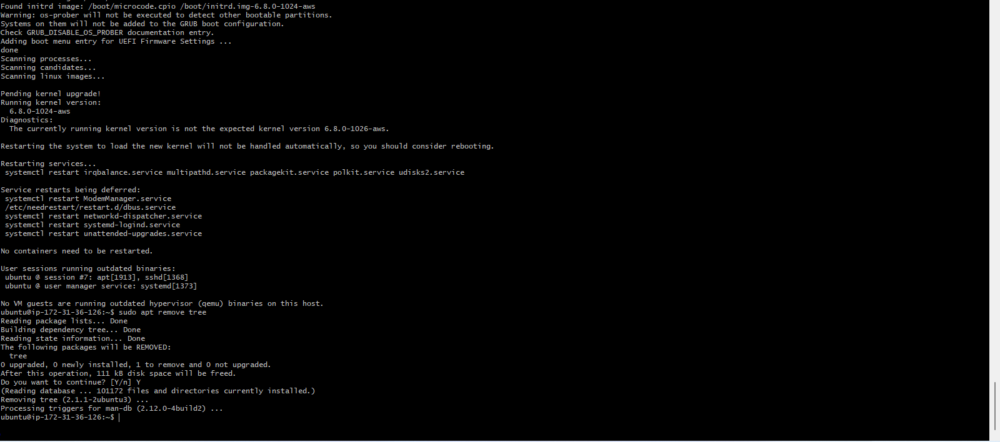

# linux-foundation

This repository covers the basic linux foundation project in the Darey.io program. The project is divided into two sections, the first teaches the learners on how to **connect to a remote server** while the second helps learners understand **Package management**

## Connecting to a Remote Server

The various steps are to be taken to create a remote server on AWS

_1. Sign into your AWS account_
_2. Search for Elastic Cloud Compute on the search bar_
_3. From the result on the menu, select instances_
_4. Select launch instances on the top right side_
_5.Name your instance, select ubuntu as the OS and the create a key which will be downloaded on your machine_

### Connecting to the server via SSH

Step 1: cd into downloads using the ``cd ~/Downloads`` command to locate the **.pem** file that was downloaded.

Step 2: ssh into the server using the ``ssh -i "ubuntu.pem" ubuntu@public_ip_address`` command.

## Package Management

This section covers various tasks such as **Installing**, **Updating**, and **Removing** Software on the server connected to remotely.

### Updating Package List

Use the ``sudo apt update`` command to update packages on Ubuntu-based systems

### Installing Software packages
 
Install **tree** by using the ``sudo apt install tree``. **tree** command is used to visually display file system structure on a linux server.

### Updating Installed Packages

To keep your system up-to-date, use the following command ``sudo apt upgrade``

### Removing Software Packages

To remove the **tree** package we installed earlier, use the ``sudo apt remove tree`` command

